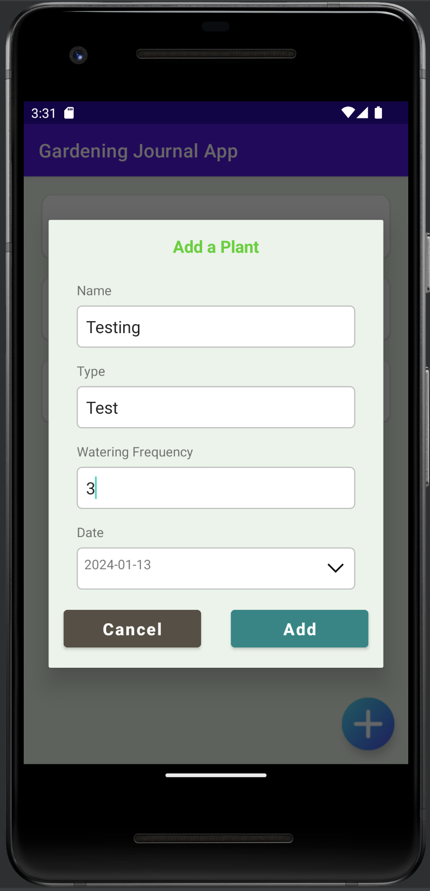

# Assignment 7 - Gardening Journal App

## Running the Android Application

Follow these steps to run the Android application using Android Studio:

### Prerequisites
- Install Android Studio: Make sure you have [Android Studio](https://developer.android.com/studio) installed on your machine.

### Clone the Repository
1. Open your terminal.
2. Clone the repository to your local machine by running the following command:
   ```bash
   git clone https://github.com/nthanhdo2610/mobile-device-programming.git

### Open Project in Android Studio
1. Launch Android Studio.
2. Click on "Open an existing Android Studio project."
3. Navigate to the location where you cloned the repository and select the "lab8" folder.

### Configure the Android Virtual Device (AVD)
1. Click on the "AVD Manager" icon in the toolbar (it looks like a phone).
2. Click on "Create Virtual Device."
3. Choose a hardware profile and click "Next."
4. Select a system image (e.g., Pixel 3, API level 30) and click "Next."
5. Configure the AVD settings and click "Finish."

### Build and Run the Application
1. Open the MainActivity.java file in Android Studio.
2. Locate the green play button (Run 'app') in the toolbar and click on it.
3. Choose the AVD you created and click "OK."
4. Wait for the application to build and launch on the virtual device.

### Screenshots



